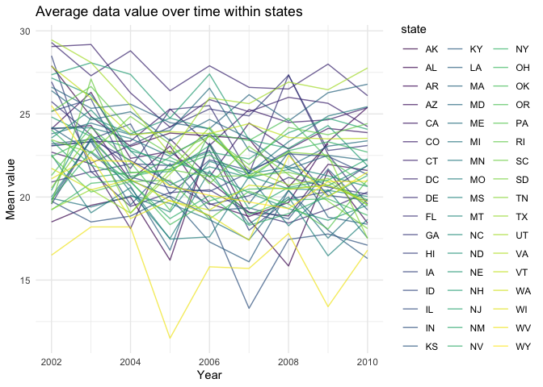
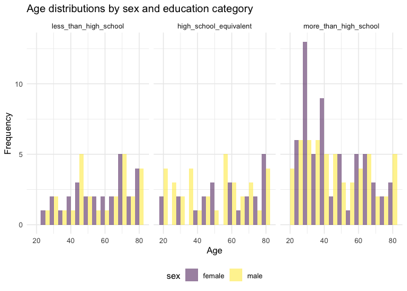

p8105_hw3_sp4170.rmd
================
Shihui Peng
2023-10-14

load libraries and packages that will be used. Then, set options using
code provided by Jeff in the lecture.

# Problem 1

#### Read in the data

``` r
data("instacart")

instacart = 
  instacart |> 
  as_tibble()
```

#### Answer questions about the data

This dataset contains 1384617 rows and 15 columns, with each row
resprenting a single product from an instacart order. Variables include
identifiers for user, order, and product; the order in which each
product was added to the cart. There are several order-level variables,
describing the day and time of the order, and number of days since prior
order. Then there are several item-specific variables, describing the
product name (e.g. Yogurt, Avocado), department (e.g. dairy and eggs,
produce), and aisle (e.g. yogurt, fresh fruits), and whether the item
has been ordered by this user in the past. In total, there are 39123
products found in 131209 orders from 131209 distinct users.

Below is a table summarizing the number of items ordered from aisle. In
total, there are 134 aisles, with fresh vegetables and fresh fruits
holding the most items ordered by far.

``` r
instacart |> 
  count(aisle) |> 
  arrange(desc(n))
```

    ## # A tibble: 134 × 2
    ##    aisle                              n
    ##    <chr>                          <int>
    ##  1 fresh vegetables              150609
    ##  2 fresh fruits                  150473
    ##  3 packaged vegetables fruits     78493
    ##  4 yogurt                         55240
    ##  5 packaged cheese                41699
    ##  6 water seltzer sparkling water  36617
    ##  7 milk                           32644
    ##  8 chips pretzels                 31269
    ##  9 soy lactosefree                26240
    ## 10 bread                          23635
    ## # ℹ 124 more rows

Next is a plot that shows the number of items ordered in each aisle.
Here, aisles are ordered by ascending number of items.

``` r
instacart |> 
  count(aisle) |> 
  filter(n > 10000) |> 
  mutate(aisle = fct_reorder(aisle, n)) |> 
  ggplot(aes(x = aisle, y = n)) + 
  geom_point() + 
  labs(title = "Number of items ordered in each aisle") +
  theme(axis.text.x = element_text(angle = 60, hjust = 1))
```

<!-- -->

Our next table shows the three most popular items in aisles
`baking ingredients`, `dog food care`, and `packaged vegetables fruits`,
and includes the number of times each item is ordered in your table.

``` r
instacart |> 
  filter(aisle %in% c("baking ingredients", "dog food care", "packaged vegetables fruits")) |>
  group_by(aisle) |> 
  count(product_name) |> 
  mutate(rank = min_rank(desc(n))) |> 
  filter(rank < 4) |> 
  arrange(desc(n)) |>
  knitr::kable()
```

| aisle                      | product_name                                  |    n | rank |
|:---------------------------|:----------------------------------------------|-----:|-----:|
| packaged vegetables fruits | Organic Baby Spinach                          | 9784 |    1 |
| packaged vegetables fruits | Organic Raspberries                           | 5546 |    2 |
| packaged vegetables fruits | Organic Blueberries                           | 4966 |    3 |
| baking ingredients         | Light Brown Sugar                             |  499 |    1 |
| baking ingredients         | Pure Baking Soda                              |  387 |    2 |
| baking ingredients         | Cane Sugar                                    |  336 |    3 |
| dog food care              | Snack Sticks Chicken & Rice Recipe Dog Treats |   30 |    1 |
| dog food care              | Organix Chicken & Brown Rice Recipe           |   28 |    2 |
| dog food care              | Small Dog Biscuits                            |   26 |    3 |

Finally is a table showing the mean hour of the day at which Pink Lady
Apples and Coffee Ice Cream are ordered on each day of the week. This
table has been formatted in an untidy manner for human readers. Pink
Lady Apples are generally purchased slightly earlier in the day than
Coffee Ice Cream, with the exception of day 5.

``` r
instacart |>
  filter(product_name %in% c("Pink Lady Apples", "Coffee Ice Cream")) |>
  group_by(product_name, order_dow) |>
  summarize(mean_hour = mean(order_hour_of_day)) |>
  pivot_wider(
    names_from = order_dow, 
    values_from = mean_hour) |>
  knitr::kable(digits = 2)
```

    ## `summarise()` has grouped output by 'product_name'. You can override using the
    ## `.groups` argument.

| product_name     |     0 |     1 |     2 |     3 |     4 |     5 |     6 |
|:-----------------|------:|------:|------:|------:|------:|------:|------:|
| Coffee Ice Cream | 13.77 | 14.32 | 15.38 | 15.32 | 15.22 | 12.26 | 13.83 |
| Pink Lady Apples | 13.44 | 11.36 | 11.70 | 14.25 | 11.55 | 12.78 | 11.94 |

# Problem 2

## read in the data

``` r
data("brfss_smart2010")
```

## data cleaning

- First, do some data cleaning:
  - format the data to use appropriate variable names using
    `janitor::clean_names()`;
  - focus on the “Overall Health” topic using `filter()`
  - include only responses from “Excellent” to “Poor” also using
    `filter()`
  - organize responses as a factor taking levels ordered from “Poor” to
    “Excellent” using `mutate()` and `fct_relevel()`.

``` r
brfss_df =
brfss_smart2010 |> 
  janitor::clean_names() |> 
  filter(
    topic == 'Overall Health', 
    response == 'Excellent' | response == 'Very good' | response =='Good' | response == 'Fair' | response == 'Poor') |> 
  mutate(
    response = fct_relevel(response, c('Poor', 'Fair', 'Good', 'Very good', 'Excellent'))
  ) |> 
  rename(state = locationabbr, state_location = locationdesc)
```

- i named the cleaned dataset as ’brfss_df’and also rename variable
  locationabbr as state and variable locationdesc as state_location to
  improve reading experience. the cleaned dataset has 10625 rows and 23
  cols.

## answer questions

### Prob 2 - Question 1

In 2002, which states were observed at 7 or more locations? What about
in 2010?

``` r
brfss_2002_df =
brfss_df |> 
  filter(year == 2002) |> 
  group_by(state) |> 
  summarise(n_locations = n_distinct(state_location)) |> 
  filter(n_locations >= 7)
```

- in 2002, states **CT, FL, MA, NC, NJ, PA** were observed at 7 or more
  locations.

``` r
brfss_2010_df =
brfss_df |> 
  filter(year == 2010) |> 
  group_by(state) |> 
  summarise(n_locations = n_distinct(state_location)) |> 
  filter(n_locations >= 7)
```

- in 2010, states **CA, CO, FL, MA, MD, NC, NE, NJ, NY, OH, PA, SC, TX,
  WA** were observed at 7 or more locations.

### Prob 2 - Question 2

requirement:

- Construct a dataset that is limited to Excellent responses, and
  contains, year, state, and a variable that averages the data_value
  across locations within a state.
- Make a “spaghetti” plot of this average value over time within a state
  (that is, make a plot showing a line for each state across years – the
  geom_line geometry and group aesthetic will help).

``` r
brfss_excellent_df =
brfss_df |> 
  filter(response == 'Excellent') |> 
  group_by(state, year) |> 
  mutate(
    mean_data_value = mean(data_value, na.rm = TRUE)
  ) |> 
  select(year, state, mean_data_value) |> 
  distinct(state, .keep_all = TRUE)

brfss_excellent_df |> 
  ggplot(aes(x = year, y = mean_data_value)) +
  geom_line(aes(color = state), alpha = 0.7) +
  labs(
    title = "Average data value over time within states",
    x = 'Year',
    y = 'Mean value'
  ) +
  theme(legend.position = "right")
```

<!-- -->

- here, i first create a dataset `brfss_excellent_df` following the
  requirement. This new dataset only have 3 variables, which are year,
  state, and mean_data_value and is limited to Excellent responses. Then
  i use `distinct()` to make sure i get rid of replicated rows in order
  to get a more decent dataset.
- Then i do a spaghetti plot using `geom_line()` to show average data
  value over time within states.
  - from the plot, we can see that generally, the mean_data_values
    slightly decreased for states across years, even though the
    mean_data_value themselves fluctuate for each state. The mean values
    for states mainly lie between 15 and 30 across years, only 2 states
    have mean value lower than 15 across years.

### Prob 2 - Question 3

Make a two-panel plot showing, for the years 2006, and 2010,
distribution of data_value for responses (“Poor” to “Excellent”) among
locations in NY State.

``` r
brfss_df |> 
  filter(
    state == 'NY',
    year == 2006 | year == 2010) |> 
  group_by(state_location) |> 
  ggplot(aes(x = data_value, fill = response)) +
  geom_density(alpha = 0.3) +
  geom_boxplot(alpha = 0.5) +
  facet_grid(. ~ year)+
  labs(
    title = "Distribution of data value for response among NY locations"
  )
```

<!-- -->

- here, i first filter the dataset and then do a density plot and a box
  plot and use `facet_grid()` to make it as a 2-panel plot.
  - from the plot, we can find that the response variable (we switch it
    into factor variable, so it has an order ranking from poor to
    excellent. And here, for easy description, we treat good, vary good,
    and excellent as a cluster of response for good experience)
    increases when the data_value increase, That is, for observations
    with a higher data_value, the response will be higher
    correspondingly. And the density for response from lowest to highest
    is Good, Very good, excellent, Fair, and Poor in 2006 and Good, Very
    good, Fair, Excellent, Poor for 2010. The density of Poor in 2006 is
    less than that of 2010.

# Problem 3

## data loading, tidying, and merging and organizing

Load, tidy, merge, and otherwise organize the data sets.

- include all originally observed variables
- exclude participants less than 21 years of age, and those with missing
  demographic data
- and encode data with reasonable variable classes (i.e. not numeric,
  and using factors with the ordering of tables and plots in mind).

``` r
accel_df = 
  read_csv("data/nhanes_accel.csv") |> 
  janitor::clean_names() |> 
  pivot_longer(
    min1:min1440,
    names_to = 'time',
    values_to = 'mims',
    names_prefix = 'min'
  )
```

    ## Rows: 250 Columns: 1441
    ## ── Column specification ────────────────────────────────────────────────────────
    ## Delimiter: ","
    ## dbl (1441): SEQN, min1, min2, min3, min4, min5, min6, min7, min8, min9, min1...
    ## 
    ## ℹ Use `spec()` to retrieve the full column specification for this data.
    ## ℹ Specify the column types or set `show_col_types = FALSE` to quiet this message.

``` r
covar_df =
  read_csv("data/nhanes_covar.csv", skip = 4) |> 
  janitor::clean_names()
```

    ## Rows: 250 Columns: 5
    ## ── Column specification ────────────────────────────────────────────────────────
    ## Delimiter: ","
    ## dbl (5): SEQN, sex, age, BMI, education
    ## 
    ## ℹ Use `spec()` to retrieve the full column specification for this data.
    ## ℹ Specify the column types or set `show_col_types = FALSE` to quiet this message.

``` r
final_df =
  left_join(covar_df, accel_df, by = 'seqn') |> 
  drop_na() |> 
  filter(age >= 21) |> 
  mutate(
    education = ifelse(education == 1, 'less_than_high_school', ifelse(education == 2, 'high_school_equivalent', 'more_than_high_school')),
    sex = ifelse(sex == 1,'male', 'female'),
    education = fct_relevel(education, c('less_than_high_school', 'high_school_equivalent', 'more_than_high_school'))
  )
```

- the final dataset, which is cleaned, tidied, merged, and organized,
  has 328320 rows and 7 cols.

## Questions

### Prob 3 - Question 1

- Produce a reader-friendly table for the number of men and women in
  each education category
- create a visualization of the age distributions for men and women in
  each education category. Comment on these items.

``` r
final_easy_read_df =
final_df |> 
  select(seqn, sex, education, age) |> 
  distinct(seqn, .keep_all = TRUE) |> 
  group_by(sex, education) |> 
  summarise(n_obs = n()) |>
  pivot_wider(
    names_from = 'sex',
    values_from = 'n_obs'
  ) |> 
  knitr::kable()
```

    ## `summarise()` has grouped output by 'sex'. You can override using the `.groups`
    ## argument.

``` r
final_easy_read_df
```

| education              | female | male |
|:-----------------------|-------:|-----:|
| less_than_high_school  |     28 |   27 |
| high_school_equivalent |     23 |   35 |
| more_than_high_school  |     59 |   56 |

``` r
final_df |> 
  select(seqn, sex, education, age) |> 
  distinct(seqn, .keep_all = TRUE) |> 
  ggplot(aes(x = age, fill = sex))+
  geom_histogram(binwidth = 5, alpha = 0.5, position = 'dodge') +
  facet_grid(. ~ education) +
  labs(
    title = 'Age distributions by sex and education category',
    y = 'Frequency',
    x = 'Age'
  )
```

<!-- -->

- 1st part code
  - I create a new dataframe called ‘final_easy_read_df’. here, i group
    the dataset by sex and education category using `group_by()` and
    then use `summarise()` to count how many observations in each single
    group (name this variable as n_obs). I also use `distinct()` to get
    rid of replicated rows. Then i use `pivot_wider()` and
    `knitr::kable()` to produce and present a reader-friendly table.
  - *comments*:
    - In both sex groups, most participants are educated more than high
      school (115 in total), while more females (59) get education more
      than high school than males (56).
    - Among females, least participants are educated as high school
      equivalent (23).
    - Among males, least participants are educated as less than high
      school (27).
    - for group of getting less than high school education
      (female:male=28:27) and getting more than high school education
      (female:male=59:56), counts of females are larger than of males.
      But the distribution across sex for these 2 groups are relatively
      balanced.
    - for group of high school equivalent education, counts of females
      are less than of males (female:male=23:35)
- 2nd part code
  - i create a histogram titled ‘Age distributions by sex and education
    category’ and treat age variable in x-axis and grouped by sex. I
    also use `distinct()` to get rid of replicated rows. Then i great 3
    panels based on the category of education.
  - *comments*:
    - among those with less than high school education, most females
      aged around 70 and most males aged around 45 and 70.
    - among those with high school equivalent education, most females
      aged around 80 and most males aged around 55.
    - among those with more than high school education, most females
      aged around 30 and most males aged around 30.
    - we can see that the age distribution of females are more skewed
      for those who received more than high school education, while of
      males are more average across age.
    - for group of getting less than high school education and getting
      more than high school education, counts of females are larger than
      of males. Overall, proportion of participants with more than high
      school education is larger than other 2 education groups
      separately.

### Prob 3 - Question 2

- Using your tidied dataset, aggregate across minutes to create a total
  activity variable for each participant.
- Plot these total activities (y-axis) against age (x-axis); your plot
  should compare men to women and have separate panels for each
  education level. Include a trend line or a smooth to illustrate
  differences. Comment on your plot.

``` r
final_df |>
  group_by(seqn) |> 
  mutate(sum_activity = sum(mims)) |> 
  select(seqn, sex, age, education, sum_activity) |> 
  distinct(seqn, .keep_all = TRUE) |> 
  ggplot(aes(x = age, y = sum_activity, color = sex)) +
  geom_smooth(se = FALSE) +
  facet_grid(. ~ education) +
  labs(
    title = 'Total activity over the day by sex and education',
    y = 'total activity over a day',
    x = 'Age'
  )
```

    ## `geom_smooth()` using method = 'loess' and formula = 'y ~ x'

<!-- -->

I calculate the sum activity of each observation in a day and create is
as a new col named ‘sum_activity’. I use `distinct()` to get rid of
replicated rows. I include a smooth in my plot.

- *comments*:
  - for each education group, the sum_activity would generally decrease
    when ages increase for both genders. but for high school equivalent
    group, sum_activity would first increased apparently until age
    arrived around 40 yrs, then it will go down. For more than high
    school group, sum_activity will fluctuate until age arrived around
    55 yrs and then it will go down. For less than high school group,
    sum_activity will temporarily increase between age around 47 and 60.
  - for education group that is high school equivalent and more than
    high school, for most age, the sum_activity for females surpass
    males.
  - For less than high school education group, before age around 50,
    females’ sum_activity surpass males’, but after around age of 50,
    the situation reverse.
  - the range of total activity over a day across age for less than high
    school education group is larger than the other 2 education groups.

### Prob 3 - Question 3

Accelerometer data allows the inspection activity over the course of the
day. Make a three-panel plot that shows the 24-hour activity time
courses for each education level and use color to indicate sex. Describe
in words any patterns or conclusions you can make based on this graph;
including smooth trends may help identify differences.

``` r
final_df |>
  select(sex, education, time, mims) |> 
  group_by(time, sex, education) |> 
  mutate(
    time = as.numeric(time),
    mean_activity_sex_edu = mean(mims)
  ) |> 
  ggplot(aes(x = time, y = mean_activity_sex_edu, color = sex)) +
  geom_point(alpha = 0.1) +
  geom_smooth(se = FALSE) +
  scale_x_continuous(
    breaks = c(0, 500, 1000, 1500),
    ) +
  facet_grid(. ~ education) +
  labs(
    x = 'Minutes of a day',
    y = 'Mean activity over a day',
    title = '24-hour activity across sex and education'
  )
```

    ## `geom_smooth()` using method = 'gam' and formula = 'y ~ s(x, bs = "cs")'

<!-- -->

- I calculate the mean of activity mims data for each minute across sex
  and education and create a new col named as ‘mean_activity_sex_edu’. I
  also switch variable time to numeric type to draw the plot. Then, when
  doing the scatterplot and smooth line, I use variable time as x-axis
  and mean_activity_sex_edu as y-axis and color based on sex groups.
  Then i create 3 panels based on education categories.

- *comment*:

  - for both sex, the mean activity will decrease from the start of a
    day until time goes to around 250 mins of a day. Then the mean
    activity will increase until time goes to around 750 mins of a day.
    Then the mean activity will decrease till the end of day.
  - for each education level, the lowest mean activity of a day is
    similar, while for the highest mean activity of a day, group less
    than high school will have more mean activity than other two groups.
  - the distribution of mean activity over a day seems generally to be
    overlapped for both gender, while females are more likely to have a
    larger max mean activity over a day than males for high school
    equivalent education group and more than high school education
    group. for less than high school education group, females appear to
    have a lower min mean activity over a day than males.
