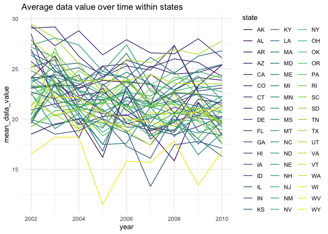

p8105_hw3_sp4170.rmd
================
Shihui Peng
2023-10-14

load libraries and packages that will be used. Then, set options using
code provided by Jeff in the lecture.

# Problem 2

## data cleaning

- First, do some data cleaning:
  - format the data to use appropriate variable names using
    `janitor::clean_names()`;
  - focus on the “Overall Health” topic using `filter()`
  - include only responses from “Excellent” to “Poor” also using
    `filter()`
  - organize responses as a factor taking levels ordered from “Poor” to
    “Excellent” using `mutate()` and `fct_relevel()`.

``` r
brfss_df =
brfss_smart2010 |> 
  janitor::clean_names() |> 
  filter(
    topic == 'Overall Health', 
    response == 'Excellent' | response == 'Very good' | response =='Good' | response == 'Fair' | response == 'Poor') |> 
  mutate(
    response = fct_relevel(response, c('Poor', 'Fair', 'Good', 'Very good', 'Excellent'))
  )
```

i named the cleaned dataset as ‘brfss_df’.

## answer questions

### Question 1

In 2002, which states were observed at 7 or more locations? What about
in 2010?

``` r
brfss_2002_df =
brfss_df |> 
  filter(year == 2002) |> 
  group_by(locationabbr) |> 
  summarise(n_locations = n_distinct(locationdesc)) |> 
  filter(n_locations >= 7)
```

- in 2002, states **CT, FL, MA, NC, NJ, PA** were observed at 7 or more
  locations.

``` r
brfss_2010_df =
brfss_df |> 
  filter(year == 2010) |> 
  group_by(locationabbr) |> 
  summarise(n_locations = n_distinct(locationdesc)) |> 
  filter(n_locations >= 7)
```

- in 2010, states **CA, CO, FL, MA, MD, NC, NE, NJ, NY, OH, PA, SC, TX,
  WA** were observed at 7 or more locations.

### Question 2

requirement:

- Construct a dataset that is limited to Excellent responses, and
  contains, year, state, and a variable that averages the data_value
  across locations within a state.
- Make a “spaghetti” plot of this average value over time within a state
  (that is, make a plot showing a line for each state across years – the
  geom_line geometry and group aesthetic will help).

``` r
brfss_excellent_df =
brfss_df |> 
  filter(response == 'Excellent') |> 
  group_by(locationabbr) |> 
  mutate(
    mean_data_value = mean(data_value, na.rm = TRUE)
  ) |> 
  select(year, locationabbr, mean_data_value) |> 
  distinct()

brfss_excellent_df |> 
  ggplot(aes(x = year, y = mean_data_value)) +
  geom_line(aes(group = locationabbr, color = locationabbr)) +
  labs(
    title = "Average data value over time within states"
  )
```

<!-- -->

- here, i first create a dataset `brfss_excellent_df` following the
  requirement. This new dataset only have 3 variables, which are year,
  locationabbr, and mean_data_value and is limited to Excellent
  responses. Then i do a spaghetti plot using geom_line() to show
  average data value over time within states.

### Question 3

Make a two-panel plot showing, for the years 2006, and 2010,
distribution of data_value for responses (“Poor” to “Excellent”) among
locations in NY State.

``` r
brfss_df |> 
  filter(
    locationabbr == 'NY',
    year == 2006 | year == 2010) |> 
  group_by(locationdesc) |> 
  ggplot(aes(x = data_value, fill = response)) +
  geom_density(alpha = 0.3) +
  facet_grid(. ~ year)+
  labs(
    title = "Distribution of data value for response among NY locations"
  )
```

<!-- -->

- here, i first filter the dataset and then do a density plot and use
  `facet_grid()` to make it as a 2-panel plot.

# Problem 3

## data loading, tidying, and merging and organizing

Load, tidy, merge, and otherwise organize the data sets. \* include all
originally observed variables \* exclude participants less than 21 years
of age, and those with missing demographic data \* and encode data with
reasonable variable classes (i.e. not numeric, and using factors with
the ordering of tables and plots in mind).

``` r
accel_df = 
  read_csv("data/nhanes_accel.csv") |> 
  janitor::clean_names()
```

    ## Rows: 250 Columns: 1441
    ## ── Column specification ────────────────────────────────────────────────────────
    ## Delimiter: ","
    ## dbl (1441): SEQN, min1, min2, min3, min4, min5, min6, min7, min8, min9, min1...
    ## 
    ## ℹ Use `spec()` to retrieve the full column specification for this data.
    ## ℹ Specify the column types or set `show_col_types = FALSE` to quiet this message.

``` r
covar_df =
  read_csv("data/nhanes_covar.csv", skip = 4) |> 
  janitor::clean_names()
```

    ## Rows: 250 Columns: 5
    ## ── Column specification ────────────────────────────────────────────────────────
    ## Delimiter: ","
    ## dbl (5): SEQN, sex, age, BMI, education
    ## 
    ## ℹ Use `spec()` to retrieve the full column specification for this data.
    ## ℹ Specify the column types or set `show_col_types = FALSE` to quiet this message.

``` r
final_df =
  left_join(covar_df, accel_df, by = 'seqn') |> 
  drop_na(sex, age, bmi, education) |> 
  filter(age >= 21) |> 
  mutate(
    education = as.factor(education),
    sex = case_match(sex, 1 ~ 'male', 2 ~ 'female')
  )
```
